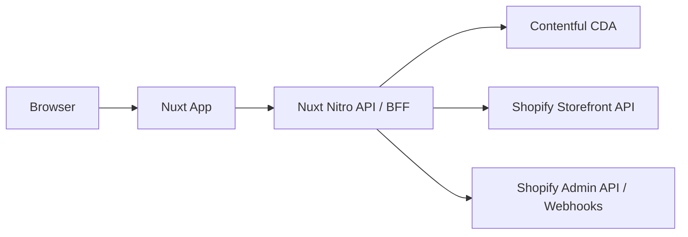

# Architecture Overview

## System Diagram

## Responsibilities

### Nuxt (Frontend + BFF)

- SSR/ISR storefront rendering.
- API orchestration between Contentful and Shopify.
- Server-only secret management.
- Edge/server caching and cache invalidation.

### Contentful (Headless CMS)

- Homepage blocks, navigation, footer, legal text, banners.
- Localized editorial content (`en-US`, `pt-BR`, etc).
- Publishing workflow and content governance.

### Shopify (Commerce Engine)

- Products, variants, pricing, inventory, checkout.
- Shipping rates and payment processing.
- Order lifecycle.

## Data Ownership

- **Contentful fields** can reference Shopify entities by `shopifyProductHandle` / `shopifyCollectionHandle`.
- Product price/stock are never edited in Contentful.

## Environments

### Contentful

- `dev` → model/content development
- `staging` → pre-production validation
- `master` (or alias `production`) → production publishing

### Application

- `development`, `staging`, `production`
- Distinct API tokens per environment

## Security

- Keep provider tokens server-side only.
- Validate webhook signatures.
- Rotate leaked tokens immediately.
- Use least-privilege keys per environment.
